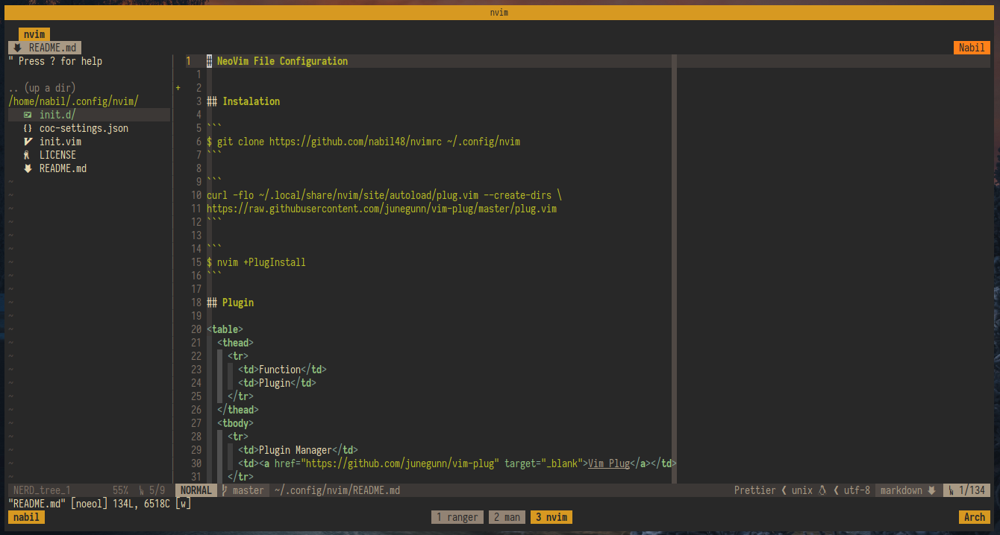

# 🛠️ Neovim Configuration

A modern, Lua-based Neovim setup designed for efficiency and customization.

## 📸 Preview



## 🌟 Features

- 🚀 Lazy-loaded plugins via [lazy.nvim](https://github.com/folke/lazy.nvim)
- 🎨 Gruvbox theme with custom highlights
- 🧠 Intelligent code completion and LSP support
- 🧰 Modular setup under `lua/config/`
- 🔍 Telescope for fuzzy finding
- 🗂️ File explorer with `sfm.nvim`
- 🧱 Git integration with `gitsigns.nvim` and `neogit`

## 📂 Structure

- `init.lua`: main entry point
- `lua/config/`: modular config files (keymaps, plugins, settings)
- `lsp/`: custom LSP setups
- `colors/`: custom colorscheme
- `snippets/`: custom snippets

## 🧰 Installation

```bash
git clone https://github.com/mnabila/nvimrc ~/.config/nvim
```

## 💡 Tips

- Want to change the theme? Check `lua/config/colorscheme.lua`
- Plugins are managed in `lua/config/plugins.lua`
- LSP setup is organized inside the `lsp/` directory
- Filetype-specific settings are located in `after/ftplugin/`
- You can tweak general settings in `lua/config/options.lua`
- Key mappings are defined in `lua/config/keymaps.lua`

## 📜 License

This project is licensed under the [MIT License](./LICENSE).
