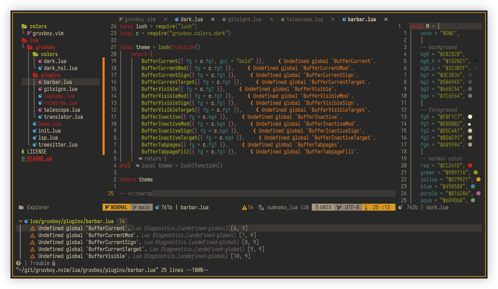

# NeoVim File Configuration

## Preview



## Instalation

### Installing Configuration

```
$ git clone https://github.com/mnabila/nvimrc ~/.config/nvim
```

```
$ nvim +PackerInstall
```

### Plugins

|    Function    | Plugins                                                                                                       |
| :------------: | ------------------------------------------------------------------------------------------------------------- |
| Plugin Manager | [packer.nvim](https://github.com/wbthomason/packer.nvim)                                                      |
|  File Manager  | [nvim-tree.lua](https://github.com/kyazdani42/nvim-tree.lua)                                                  |
|  Status line   | [galaxyline.nvim](https://github.com/glepnir/galaxyline.nvim)                                                 |
|  Buffer line   | [barbar.nvim](https://github.com/romgrk/barbar.nvim)                                                          |
|  Colorscheme   | [gruvboy.nvim](https://github.com/mnabila/gruvboy.nvim)                                                       |
|      Icon      | [nvim-web-devicons](https://github.com/kyazdani42/nvim-web-devicons)                                          |
|      Git       | [neogit](https://github.com/TimUntersberger/neogit)<br> [gitsign](https://github.com/lewis6991/gitsigns.nvim) |
| Auto Complete  | [nvim-lspconfig](https://github.com/neovim/nvim-lspconfig)                                                    |
|     Others     | [packer/init](./lua/modules/packer/init.lua)                                                                  |

### Installing Dependency

> archlinux with paru package manager

```
$ paru -S git neovim-git nodejs npm yarn python-pynvim neovim-remote the_silver_searcher bat prettier
```

#### required by language server protocol

- bashls

```
$ npm install -g bash-language-server
```

- clangd

```
$ paru -S clang
```

- cssls

```
$ npm install -g vscode-css-languageserver-bin
```

- dockerls

```
$ npm install -g dockerfile-language-server-nodejs
```

- gopls

```
$ paru -S gopls
```

- html

```
$ npm install -g vscode-html-languageserver-bin
```

- pyright

```
$ npm install -g pyright
```

- jsonls

```
$ npm install -g vscode-json-languageserver
```

- sqls

```
$ paru -S sqls-git
```

- sumneko_lua

```
$ paru -S lua-language-server-git
```

- texlab

```
$ paru -S texlive-most texlab
```

- tsserver

```
$ npm install -g typescript typescript-language-server
```

- vimls

```
$ npm install -g vim-language-server
```

- intelephense

```
$ npm install -g intelephense
```

#### required by code formater

- bash

```
$ paru -S shfmt
```

- html, json, js, markdown, css, scss, sass

```
$ paru -S prettier
```

- lua

```
$ paru -S stylua-git
```

- python

```
$ paru -S python-black
```

## License

Source is available under the [Mit License](https://github.com/mnabila/nvimrc/blob/master/LICENSE)
