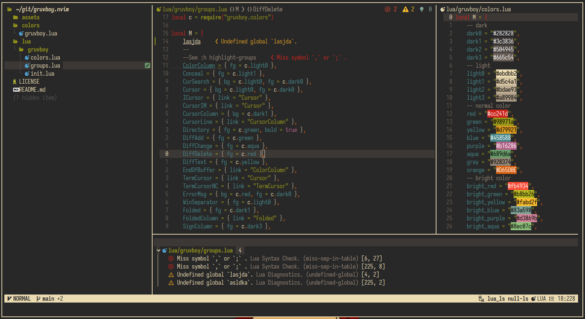

# NeoVim File Configuration

## Preview



## Instalation

### Installing Configuration

```
$ git clone https://github.com/mnabila/nvimrc ~/.config/nvim
```

> > **Note:** Makesure [lazy.nvim](https://github.com/folke/lazy.nvim) was installed

### Plugins

|    Function    | Plugins                                                             |
| :------------: | ------------------------------------------------------------------- |
| Plugin Manager | [lazy.nvim](https://github.com/folke/lazy.nvim)                     |
|  File Manager  | [sfm.nvim](https://github.com/dinhhuy258/sfm.nvim)          |
|  Status line   | [feline.nvim](https://github.com/freddiehaddad/feline.nvim)           |
|  Colorscheme   | [gruvbox.nvim](https://github.com/ellisonleao/gruvbox.nvim)             |
|      Icon      | [nvim-web-devicons](https://github.com/nvim-tree/nvim-web-devicons) |
|      Git       | [gitsign](https://github.com/lewis6991/gitsigns.nvim), [neogit](https://github.com/NeogitOrg/neogit)               |
| Auto Complete  | [blink.cmp](https://github.com/Saghen/blink.cmp)                     |
|     Others     | [configs/plugins](./lua/config/plugin/lazy/setup.lua)                   |

## License

Source is available under the [Mit License](https://github.com/mnabila/nvimrc/blob/master/LICENSE)
